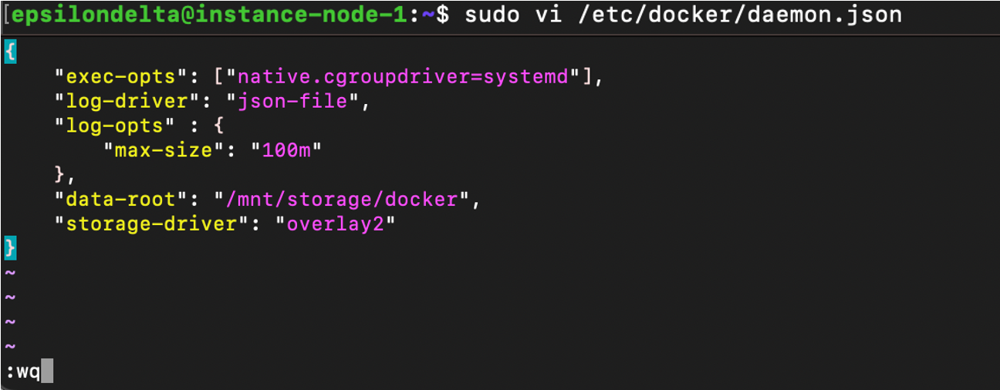

# Daemon 설정

### docker daemon 설정

```bash
sudo vi /etc/docker/daemon.json
```

```json
{
    "exec-opts": ["native.cgroupdriver=systemd"],
    "log-driver": "json-file",
    "log-opts" : {
        "max-size": "100m"
    },
    "data-root": "/mnt/storage/docker",
    "storage-driver": "overlay2"
}
```



### Docker daemon service로 등록

```bash
sudo mkdir -p /etc/systemd/system/docker.service.d
```

### Docker daemon 재실행

```bash
sudo systemctl daemon-reload
sudo systemctl restart docker
```


### 스토리지 설정 확인

```bash
sudo docker run hello-world
```

