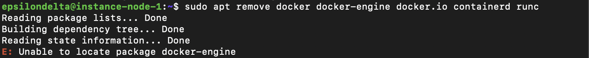

# 도커설치

[https://docs.docker.com/engine/install/ubuntu/](https://docs.docker.com/engine/install/ubuntu/)

# 사전 준비

1. 기존에 있는 old version 제거

```bash
sudo apt remove docker docker-engine docker.io containerd runc
```



# 설치

## set up apt repository

1. `apt` package index 업데이트
    
    ```bash
    sudo apt update
    ```
    
    
    

1. `apt`가 HTTPS를 통해 리포지토리를 사용할 수 있도록 패키지를 설치
    
    ```bash
    sudo apt-get install -y \
        ca-certificates \
        curl \
        gnupg
    ```
    
    
    

1. 도커 공식 GPG key 추가
    
    ```bash
    sudo install -m 0755 -d /etc/apt/keyrings
    curl -fsSL https://download.docker.com/linux/ubuntu/gpg | sudo gpg --dearmor -o /etc/apt/keyrings/docker.gpg
    sudo chmod a+r /etc/apt/keyrings/docker.gpg
    ```
    
    
    
2. 다음 명령을 사용하여 리포지토리를 설정
    
    ```bash
    echo \
      "deb [arch="$(dpkg --print-architecture)" signed-by=/etc/apt/keyrings/docker.gpg] https://download.docker.com/linux/ubuntu \
      "$(. /etc/os-release && echo "$VERSION_CODENAME")" stable" | \
      sudo tee /etc/apt/sources.list.d/docker.list > /dev/null
    ```
    
    
    

## **Install Docker Engine**

1. `apt` package index 업데이트
    
    ```bash
    sudo apt update
    ```
    
    
    
2. Docker Engine, containerd, and Docker Compose 설치(최신버전)
    
    ```bash
    sudo apt-get install -y docker-ce docker-ce-cli containerd.io docker-buildx-plugin docker-compose-plugin
    ```
    
    
    

## test docker

hello world image를 실행

```bash
sudo docker run hello-world
```

